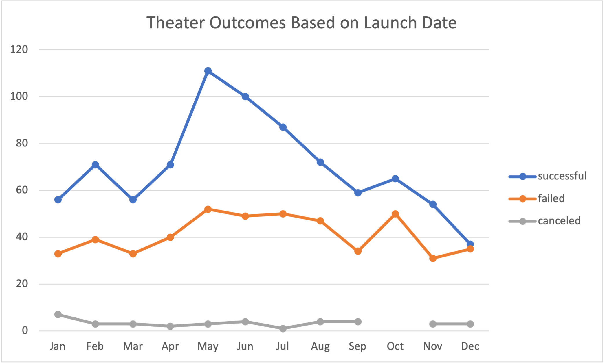
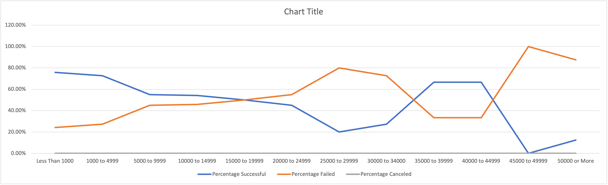

# Kickstarting with Excel Analysis
## Performing analysis on Kickstarter data to uncover trends.
### The purpose of this analysis was to assist Louise start a crowdfunding campaign and help her fund her play "Fever". I assisted Louise by analyzing crowdfunding data to determine specific factors that'll help provide insignt for Louise's campaign to be successful. By analyzing the data, I can get a better understanding of campaigns from start to finish to help Louise plan and set up her campaign for success. 

##Analysis and Challenges
###Analysis of Outcomes Based on Launch Date
- One way to determine how successful campaigns are, are to look at the outcome of campaigns based on their launch date. It's important to understand when campaigns were the most successful as well as when the most campaigns failed. This will help us determine around when the best time is to potentially launch a campaign. 

###Analysis of Outcomes Based on Goals
- Another way to determine how successful campaigns are, are to look at the percentage of the outcomes of campaigns based on their funding goals. So understanding the percent of campaigns that were successful, that failed, and were canceled based on their funding goal amount.

###Challenges and Difficulties Encountered
- 

##Results
- There are two conclusion you can draw from the outcomes based on launch date. First, based on the 'Theater Outcomes by Launch Date' graph, you can see that the campaigns launched during the months of May and June were the most successful. However, the month of May also had the highest amount of failed campaigns. The months of July and October also showed a high amount of failed campaigns. The second conclusion you can gather from the graph is that overall, more campaigns succeeded rather than failed. However, in the month of December about the same amount of campgains succeeded and failed, with successful campaigns being slightly higher than failed. 

- By looking at the 'Outcomes vs Goals' graph, you can see that the most successful campaigns, were those who had a funding goal of around $4,999 or less, with the most successfull having a funding goal of $1,000 or less. Campaigns that also had a goal around $35,000 to $44,999 were also successful with around 67% successful. However, Campaigns with a funding goal of $45,000 to $49,999 all failed. In addition, campaigns that had funding goals around $25,000 to $34,000, had high failure percentages ranging from 73% to 80% failed.

- There are some of the limitations of this dataset though. One limitation to this dataset is potentially the sample size. Looking at the outcomes based on goals, the percentages of campaigns that were successful and failed continues to switch. By gathering more data, the more accurate the analyses will be in finding the percentages of those that were successful and failed based on funding goals.  
- There are some other possible tables and or graphs that we can look at as well to help Louise with a successful campaign. One possibility is looking at the duration of time between the launch date and end date, to see if those that had a longer duration of time were more successful compared to those with a shorter duration of time. Another possibility would be to look at the percentage funded. By seeing the fund percent of the campaigns, we can potential understand and see if those that were funded more have higher successful campaigns compared to those that had a lower funding percent. 
